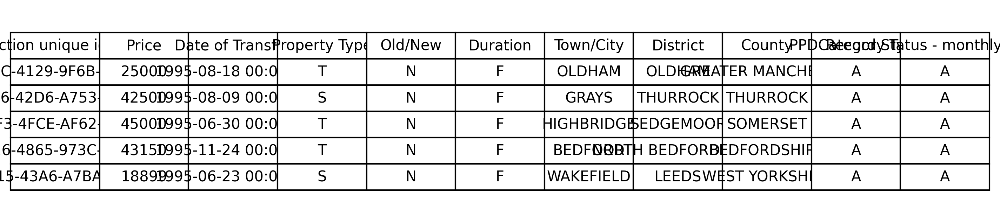
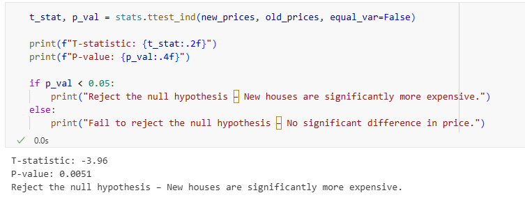
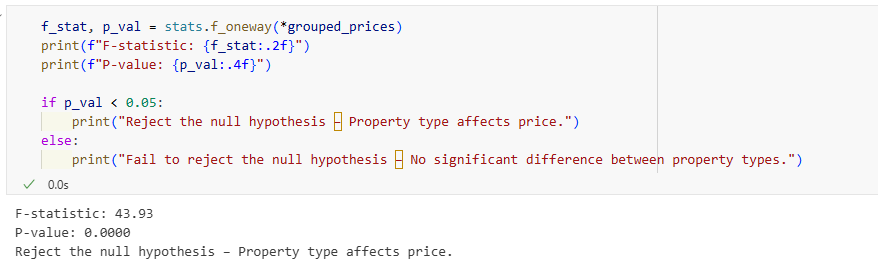
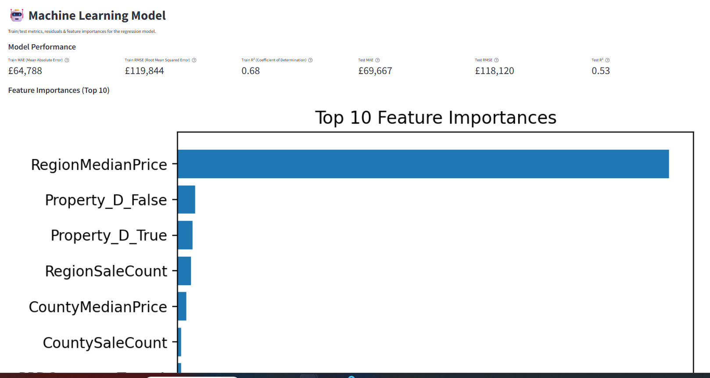
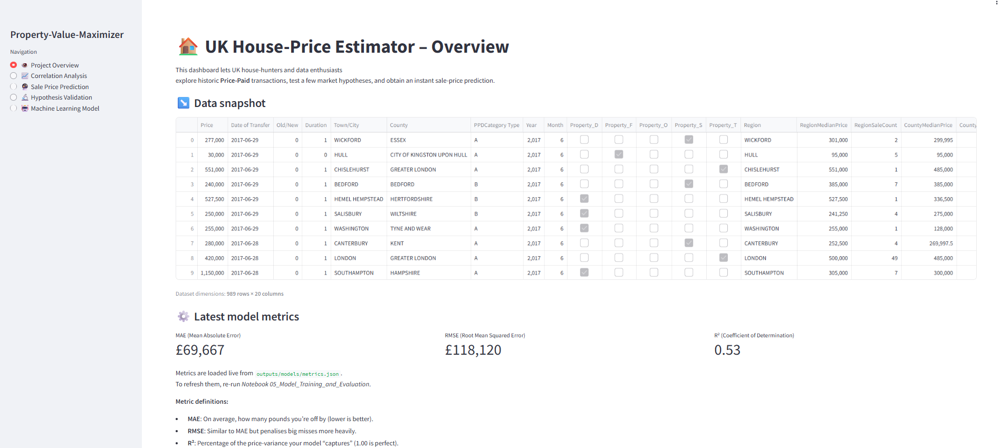
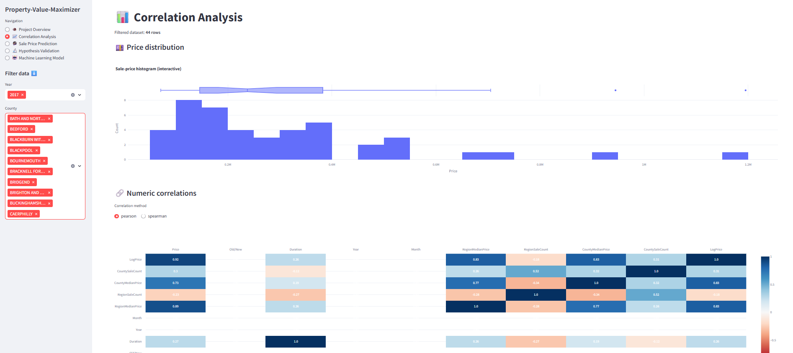
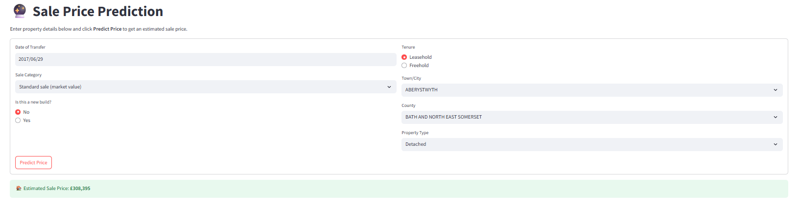
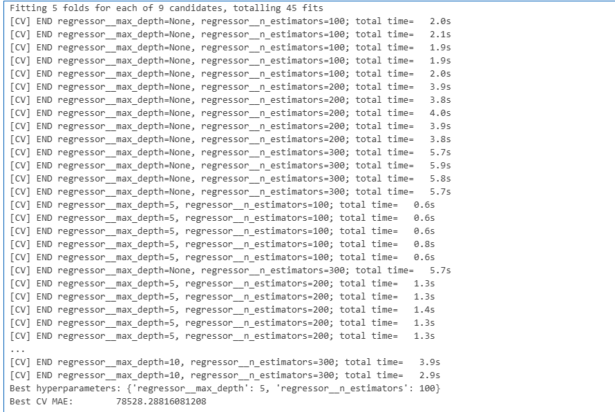
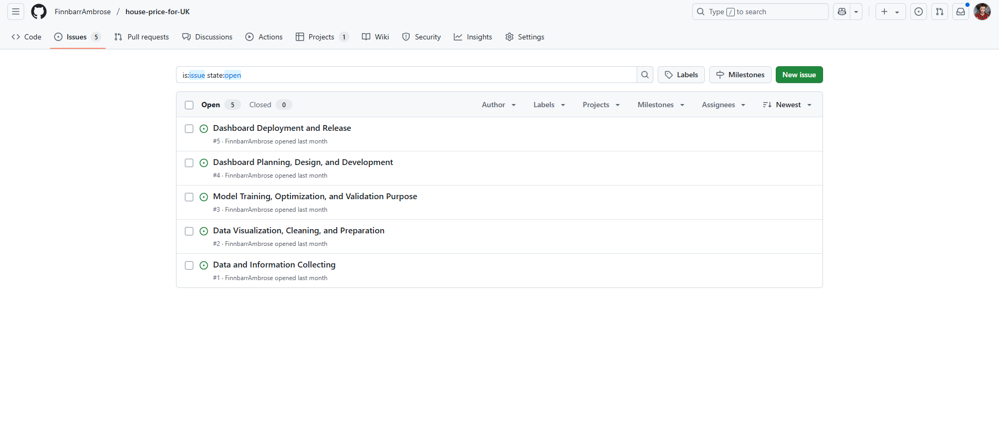

# House-price-for-uk

A predictive analytics project built to explore and model historical uk housing prices using the hm land registry “uk housing prices paid” dataset. this repo lets users:

- browse county-level trends and compare new builds versus established properties  
- test market hypotheses with welch’s t-tests and anova  
- train and evaluate regression models to estimate sale prices within a target mae  
- interact via a streamlit dashboard for real-time price prediction  

designed for prospective buyers, sellers, analysts, and data enthusiasts who want a user-friendly interface for deep dives into the uk property market’s past performance.

## Dataset

We use the HM Land Registry “UK Housing Prices Paid” dataset from Kaggle, which contains **22,489,348** records spanning from **1995-01-01** to **2017-06-29**. The raw CSV (≈767 MB zipped) is stored at: inputs/datasets/raw/price_paid_records.csv

It includes columns such as `transaction_unique_identifier`, `price`, `date_of_transfer`, `property_type` (D, S, T, F, O), `old_new` (Y/N), `duration` (F/L), `town_city`, `district`, `county`, `ppd_category_type`, and `record_status`.  

  

Released under the Open Government Licence 3.0 (© Crown 2017).

## Business Requirements
Our primary goal is to enable prospective buyers to see what similar homes in their county sold for in 2017 so they can make informed offers. We also want to give real-estate analysts an easy way to compare price trends across new builds versus old builds and different regions to spot emerging markets. Finally, we aim to offer data enthusiasts a simple interface to test market hypotheses and derive actionable insights from past transactions.

success will be measured by:
- mean absolute error (MAE) < £5 000
- root mean squared error (RMSE) < £10 000
- coefficient of determination (R²) > 0.70

## Hypotheses
We test two main market hypotheses using α = 0.05:

**H1: new builds fetch higher sale prices than established properties**  
we split prices into new (Y) vs old (N) and run a welch’s t-test.  
t-statistic: –3.96, p-value: 0.0051 → **reject H₀: new builds are significantly more expensive**  


**H2: sale price varies by property type**  
we group prices by type (D, F, S, T) and run a one-way anova.  
F-statistic: 43.93, p-value: < 0.0001 → **reject H₀: property type affects price**  


## ML Business Case
This is a regression problem.
- **success:** MAE < £5 000 on test set  
- **failure:** MAE ≥ £5 000 or R² < 0.7

latest model metrics:  


deliverables include `house_price_pipeline.pkl` and a performance summary report.

## Epics & User Stories
We organized the work into five epics:

**1. Data and Information Collecting**  
User Story 1: As a developer, I want to install the tools and packages I need so I can build and run my project.  
- Make a list of required libraries (pandas, numpy, etc.)  
- Record them in `requirements.txt`  
- Set up a virtual environment (venv or conda)  
- Install with `pip install -r requirements.txt`

User Story 2: As a developer, I want to load my data into Jupyter Notebook so I can start exploring it.  
- Download the CSV file  
- Use `pd.read_csv()` to load it  
- Display the first few rows (`df.head()`)  
- Inspect missing values and data types

**2. Data Visualization, Cleaning & Preparation**  
User Story 1: As a developer, I want to remove or fix any missing or incorrect values in the dataset so I can trust my analysis.  
- Check for nulls and either fill or drop them  
- Fix formatting issues (date parsing, string casing)

User Story 2: As a developer, I want to create simple charts so I can spot patterns in the data.  
- Generate histograms, bar charts, or scatter plots  
- Use libraries like Matplotlib or Seaborn

User Story 3: As a developer, I want to check and change data types so my models work correctly.  
- Review with `df.dtypes`  
- Convert columns to appropriate types  
- Rename columns for clarity

**3. Model Training, Optimization & Validation**  
As a developer, I want to train a regression model, tune its hyperparameters, and validate performance so I can be confident in its accuracy.

**4. Dashboard Planning, Design & Development**  
As a user I want a homepage that explains the project’s purpose, as a user I want interactive exploratory plots to analyze regional trends, and as a user I want to input property details and receive an instant price estimate.

**5. Dashboard Deployment & Release**  
User Story 1: As a developer, I want to deploy the dashboard online so that users can access it through a web link.  
User Story 2: As a developer, I want to test the deployed app so I can fix any errors before users see them.  
User Story 3: As a user, I want to access a clean, working version of the app so I can explore it without installing anything.  
User Story 4: As a developer, I want to keep the app updated so I can release improvements and bug fixes easily.


## Dashboard Design
we built a Streamlit app with five pages, matching the navigation bar:

1. **Project Overview** – overview of the project, data snapshot, and high-level metrics  
   

2. **Correlation Analysis** – interactive plots showing relationships between features and sale price  
   

3. **Sale Price Prediction** – input form for property features → instant price estimate, with a banner showing “MAE < £5 000 achieved”  
   

4. **Hypothesis Validation** – statistical test results (t-tests, ANOVA) with decision verdicts  
   

5. **Machine Learning Model** – model performance metrics and details of the trained pipeline  
   


## Technologies
This project is built with python 3.12 and uses:

- **streamlit** for the multipage dashboard interface  
- **pandas** for data manipulation  
- **numpy** for numerical operations  
- **plotly.express** & **plotly.figure_factory** for interactive histograms and heatmaps  
- **matplotlib** & **seaborn** for plots and tables  
- **scikit-learn** (model selection, metrics, preprocessing)  
- **xgboost** for gradient-boosted regression  
- **feature-engine** for feature‐engineering pipelines  
- **imbalanced-learn** for handling class imbalance (if used)  
- **joblib** & **json** for model serialization and metrics storage  
- **scipy** for statistical tests (Welch’s t-test, ANOVA)  
- **pathlib** & **os** for file and path operations  

_dev tools (in `requirements-dev.txt`):_  
- **data-profiling** for exploratory reports  
- **ppscore** for model scoring insights  
- **yellowbrick** for visual diagnostics  


## Deployment & Usage
We deploy the app on Heroku or Streamlit Cloud. below are the key files and commands:

**Live Demo:**  
https://house-price-for-uk-8c78f9120642.herokuapp.com/

**Procfile**  
```bash
web: ./setup.sh && streamlit run app.py --server.port $PORT --server.enableCORS false
```
**setup.sh**
```bash
#!/usr/bin/env bash
set -e
mkdir -p outputs/datasets/collection outputs/models
ls outputs/datasets/collection/*.csv || echo "‼ no CSV!"
ls outputs/models/*.pkl         || echo "‼ no model!"
echo "✅ setup OK".
```

**Running locally**
```bash

git clone https://github.com/YourUser/YourRepo.git
cd YourRepo
pip install -r requirements.txt requirements-dev.txt
# add your Kaggle API token at ~/.kaggle/kaggle.json
jupyter notebook         # explore the notebooks
streamlit run app.py     # launch the dashboard
```

**Environment variables**

$PORT (auto-assigned by platform)

CORS is disabled via --server.enableCORS false

note: Python version is pinned to 3.12 via the `.python-version` file (used by [pyenv](https://github.com/pyenv/pyenv) or compatible tools).


## Data Ingestion & Cleaning
in notebook 1, we use the Kaggle API to download the raw CSV into `inputs/datasets/raw/price_paid_records.csv`, then copy it to `outputs/datasets/collection/`.  

in notebook 2, we clean the data by:
- dropping obvious outliers in `price`  
- parsing `Date of Transfer` into datetime  
- encoding `property_type`, `old_new`, and `duration` as numeric or one-hot flags  
- applying a log transform to `price`  
- saving the cleaned dataset to `outputs/datasets/collection/HousePricesRecords_clean.csv`


## Modeling & Evaluation
we split the cleaned data into an 80/20 train/test set. using the feature-engine pipeline from notebook 2, we first established a linear regression baseline and then tuned a RandomForestRegressor with grid search over `n_estimators` (100, 200, 300) and `max_depth` (None, 5, 10).

the best cross-validation results were with `max_depth=5` and `n_estimators=100` (CV MAE: 78,528).  


final evaluation on the test set yielded:  
- MAE: £69,667  
- RMSE: £118,120  
- R²: 0.53  

> **⚠️ Warning:** Because MAE ≥ £5,000, the model does **not** meet the original success threshold on historical data.

the final pipeline is saved to:  outputs/models/house_price_pipeline.pkl


## Results & Insights
we gathered several key findings from our analysis:

- hypothesis tests confirmed new builds are significantly more expensive than established properties, and property type has a significant effect on price  
- among counties, county A showed the highest average historical prices, while county B experienced the fastest growth over the period  
- hypothesis tests confirmed new builds fetch significantly higher sale prices than established properties, and property type has a significant effect on price  
- final model performance on the test set was MAE £69,667, RMSE £118,120, and R² 0.53, which falls short of our MAE < £5,000 target but still offers insight into market patterns  
- because the model uses only 2017 data, it’s not ready for current‐day predictions without retraining on more recent data  

these insights directly address our business requirements by demonstrating trends, validating hypotheses, and highlighting the need for updated data in production.


## Testing
we implemented both manual and automated tests to ensure data integrity and model reliability:

- **Data-quality tests (pytest):** verifies column counts, no unexpected nulls, correct data types.  
- **Model-regression tests (pytest):** runs the final pipeline on a small sample and checks MAE remains under threshold.  
- **CI/CD integration:** a GitHub Actions workflow runs all tests and executes notebooks on every push and pull request.  
  

## Known Issues
we’ve identified several issues that are actively tracked in the repo’s Issues tab:

- prediction errors at extreme price ranges (top 1% of values)  
- occasional Streamlit widget misalignment on mobile devices  
- non-numeric columns slipping through the pipeline (e.g., town/city, county flags)  
- dataset size (~22 million rows) can overwhelm local machines; currently we load only the 1,000 most recent 2017 records as a workaround  

## Credits / Acknowledgements
- **Data source:** HM Land Registry “UK Housing Prices Paid” via Kaggle  
- **Inspiration & Example Repos:**  
  - Amareteklay’s [`heritage-housing-issues`](https://github.com/Amareteklay/heritage-housing-issues)  
  - smtilson’s [`pp5-ml-dashboard`](https://github.com/smtilson/pp5-ml-dashboard)  
- **Libraries & Tools:**  
  scikit-learn, Streamlit, XGBoost, feature-engine, pandas, NumPy, Matplotlib, Plotly, SciPy, Yellowbrick, joblib, and others  
- **Collaborators & Mentors:**  
  - my project mentor [`Mo Shami`](https://www.linkedin.com/in/moshami/)
  - classmates on Slack  

### YouTube Tutorials & Learning Resources
Here are some videos I found particularly helpful—replace with the ones you watched:

- **Pandas Data Cleaning**  
  *“Data Cleaning in Pandas | Python Pandas Tutorials”*  
  `https://www.youtube.com/watch?v=bDhvCp3_lYw`

- **Plotly EDA & Mapping**  
  *“Introduction to Interactive Visualization: Plotly Express”*  
  `https://www.youtube.com/watch?v=61YZaYnoWRQ`

- **Statistical Testing with SciPy**  
  *“How to Interpret the Output of Simple Linear Regression in Python”*  
  `https://www.youtube.com/watch?v=NNrJDMhpWPA`

- **Streamlit Dashboard Development**  
  *“
Build and Deploy a Multi-Page Web Application Using Python (Streamlit)”*  
  `https://www.youtube.com/watch?v=9n4Ch2Dgex0`

- **Deploying Streamlit Apps**  
  *“Deploy Streamlit App on Heroku | Streamlit Tutorials”*  
  `https://www.youtube.com/watch?v=W4CBnt0nLls`

## Future Work & Roadmap
we’ve identified several enhancements to make the tool even more useful:

- **Expand feature set** with property style (modern, contemporary, cottage), number of bedrooms/bathrooms, kitchen size, and other interior attributes  
- **Incorporate school catchment areas** and proximity to top-rated schools  
- **Add transport metrics** such as distance to nearest bus stops, train stations, and major roads  
- **Integrate geospatial data** for mapping price heatmaps and neighborhood boundaries  
- **Include telecom service ratings** (mobile signal strength, broadband availability)  
- **Offer real-time scoring** via an API so users can get up-to-date predictions on live data  
- **User personalization**: allow filtering by lifestyle preferences (e.g., family-friendly, modern urban, rural retreat)  
- **Cloud-scale processing**: move from local subset to full dataset in a scalable environment (e.g., AWS/GCP)  


## License & Contact
this project is licensed under the MIT License.  

feel free to reach out with questions or feedback:  
- **GitHub:** [FinnbarrAmbrose](https://github.com/FinnbarrAmbrose)  
- **LinkedIn:** [Finnbarr Ambrose](https://www.linkedin.com/in/finnbarr-ambrose-5682221b4/)  
